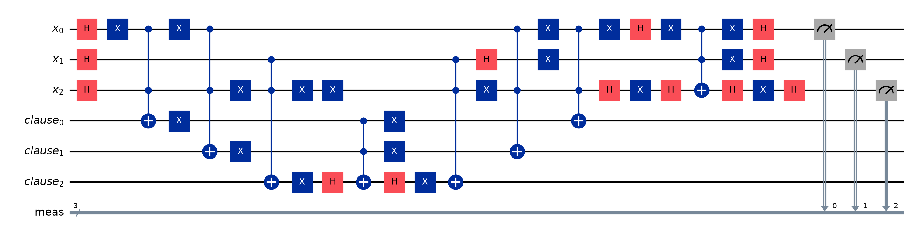

# Quantum Search for K-SAT

Grover's algorithm applied to Boolean satisfiability (K-SAT), with an explicit analysis of how hardware errors
propagate through the circuit on IBM Brisbane (127-qubit Eagle).


## Method
1. **Oracle**: one ancilla per clause computes *clause satisfied* with an X-conjugated multi-controlled X;
   a multi-controlled Z over all clause ancillas marks satisfying assignments; the ancillas are then uncomputed.
2. **Diffuser**: standard inversion about the mean on the variable register.
3. **Iterations**: ⌊π / 4θ⌋ with sin θ = √(M/N) for M solutions among N = 2ⁿ assignments.
4. **Error propagation**: using the backend calibration, the probability that the transpiled circuit runs without a
   fault is P<sub>ff</sub> = Π<sub>g</sub>(1 − e<sub>g</sub>); the predicted success is
   P<sub>ff</sub> · P<sub>ideal</sub> + (1 − P<sub>ff</sub>) · M/N. This is compared with the noisy measurement.



## Repository Structure
```
Quantum-Search-KSAT/
├── Code/
│   ├── ksat.py              # CNF instances, brute-force solutions, DIMACS I/O
│   ├── grover.py            # clause-ancilla phase oracle, diffuser, Grover circuit
│   ├── error_analysis.py    # gate-error budget and success prediction
│   ├── run_experiments.py   # ideal vs. noisy runs, writes Results/ and Figures/
│   └── requirements.txt
├── Dataset/                 # DIMACS CNF instances
├── Figures/                 # success curves, histograms, circuit diagram
├── Results/                 # JSON outputs and summary tables
├── LICENSE
└── README.md
```

## Quick Start
```bash
cd Code
pip install -r requirements.txt
python run_experiments.py                                  # FakeBrisbane noise model
python run_experiments.py --vars 4 --clauses 7 --k 3        # 3-SAT, 4 variables, 2 solutions (12 qubits)
python run_experiments.py --backend ibm_brisbane           # real hardware (saved IBM Quantum account)
```

## Author
**Wajiha Rahim Khan**  
[Google Scholar](https://scholar.google.com/citations?user=ctvOkbYAAAAJ) · [Email](mailto:wajihakhan906@gmail.com)

## License
MIT. See [LICENSE](LICENSE).
