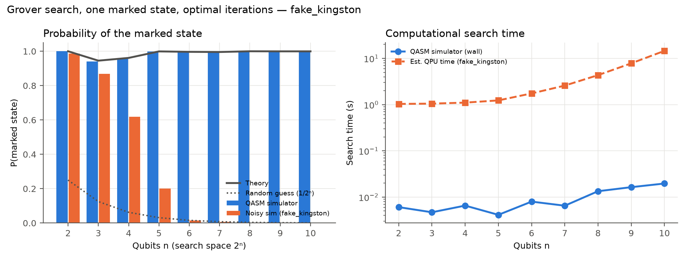
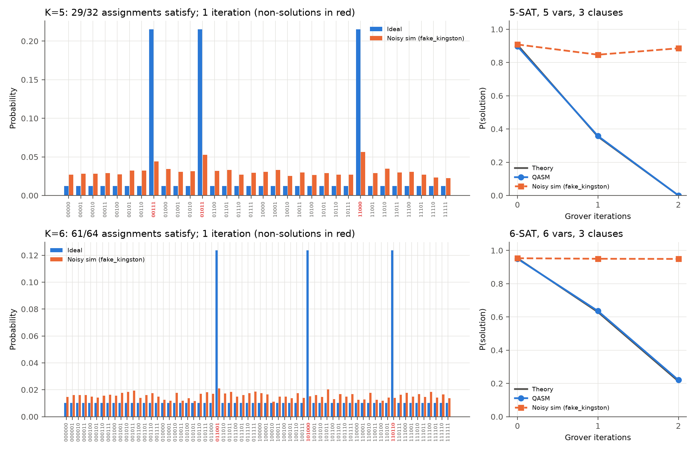
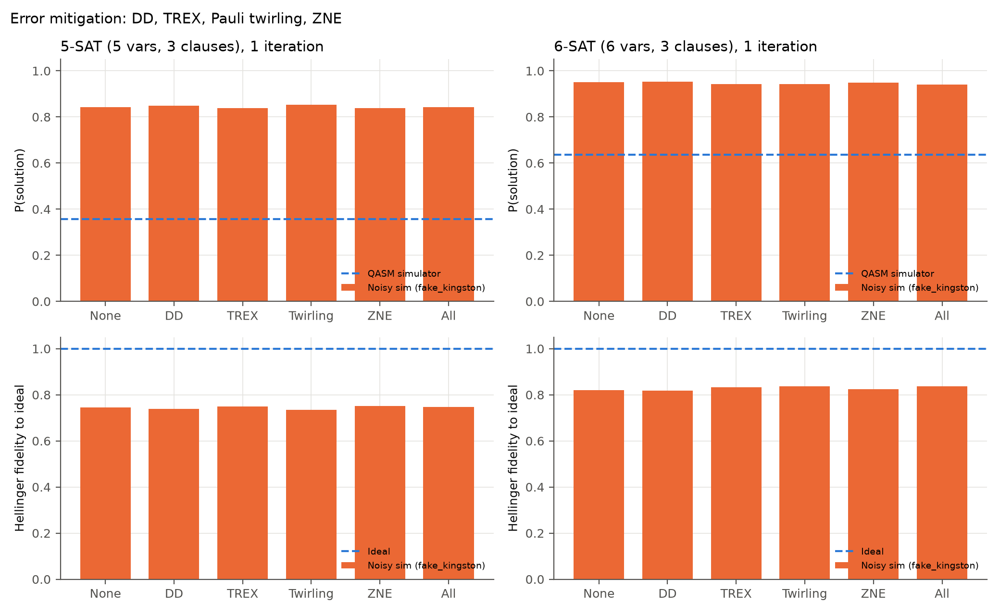

# Results

## Simulated run in this repository (`fake_brisbane_v3_c3_s3.json`)
Instance (2-SAT, 3 variables, 3 clauses): **(x1 ∨ ¬x3) ∧ (¬x3 ∨ ¬x1) ∧ (¬x2 ∨ x3)**, solutions 000, 001 (bit order x3 x2 x1).
Backend: **FakeBrisbane** calibration snapshot as an Aer noise model, 8192 shots, `optimization_level=3`.

| Grover iterations | ECR gates | Depth | P(success) theory | P(success) noisy | Error-propagation model | P(fault-free) |
|---|---|---|---|---|---|---|
| 0 | 0 | 4 | 0.250 | 0.258 | 0.250 | 0.980 |
| 1 | 77 | 345 | 1.000 | 0.608 | 0.645 | 0.527 |
| 2 | 159 | 712 | 0.250 | 0.280 | 0.250 | 0.278 |
| 3 | 241 | 1060 | 0.250 | 0.261 | 0.250 | 0.166 |

- One iteration is optimal (M/N = 2/8 → rotation of exactly π/2), giving P = 1 on ideal hardware.
- On the noise model the transpiled circuit has ~77 ECR gates; the fault-free probability drops to ~0.53 and the
  measured success to ~0.61, which the simple error-propagation model (fault-free runs succeed, faulty runs return a
  uniformly random string) predicts to within a few percent.
- Extra iterations add ~80 ECR gates each and push the output towards the uniform distribution.

Simulated numbers vary slightly between runs (shot noise and transpiler seeds) and will differ on real IBM Brisbane hardware.

## Six-step pipeline: FakeKingston noise model (`pipeline_fake_kingston.json`)
These runs use the ibm_kingston calibration snapshot as an Aer noise model, with 4096 shots and `optimization_level=3`. Times are the QASM-simulator
wall time and the estimated QPU time, shots × (circuit duration + 250 µs repetition delay).

**Steps 1-3: one marked state, optimal iterations**

| n | iterations | CZ gates | P theory | P QASM | P noisy | est. QPU time (s) |
|---|---|---|---|---|---|---|
| 2 | 1 | 2 | 1.000 | 1.000 | 0.987 | 1.0 |
| 3 | 2 | 37 | 0.945 | 0.940 | 0.869 | 1.1 |
| 4 | 3 | 161 | 0.961 | 0.959 | 0.618 | 1.1 |
| 5 | 4 | 517 | 0.999 | 0.999 | 0.201 | 1.2 |
| 6 | 6 | 1616 | 0.997 | 0.997 | 0.014 | 1.7 |
| 7 | 8 | 3844 | 0.996 | 0.995 | 0.007 | 2.6 |
| 8 | 12 | 9288 | 1.000 | 1.000 | 0.003 | 4.3 |
| 9 | 17 | 19551 | 0.999 | 0.999 | 0.001 | 7.8 |
| 10 | 25 | 40167 | 0.999 | 0.999 | 0.001 | 14.5 |

Up to n = 4 the marked state is found. From n = 5 onward the circuit holds hundreds to tens of thousands of CZ gates, and the output
on the noise model is close to uniform (1/2ⁿ).

**Steps 4-5: K-SAT, 3 clauses** (`Dataset/instance_k5_v5_c3_s10.cnf`, `Dataset/instance_k6_v6_c3_s11.cnf`)

| instance | iterations | CZ gates | P theory | P QASM | P noisy |
|---|---|---|---|---|---|
| K=5, 5 vars | 0 / 1 / 2 | 0 / 537 / 1143 | 0.906 / 0.354 / 0.000 | 0.897 / 0.358 / 0.000 | 0.908 / 0.847 / 0.885 |
| K=6, 6 vars | 0 / 1 / 2 | 0 / 792 / 1781 | 0.953 / 0.629 / 0.213 | 0.950 / 0.636 / 0.220 | 0.953 / 0.950 / 0.949 |

> **Caveat:** when K equals the number of variables, each clause rules out exactly one assignment. Three clauses therefore leave
> 29/32 (K=5) or 61/64 (K=6) satisfying assignments. With M/N > 1/2, Grover iterations *lower* P(solution) (theory column).
> The noisy values only look higher because a decohered output is uniform, and a uniform output already gives M/N ≈ 0.91-0.95.
> For a meaningful speed-up, choose instances with M/N ≪ 1/2, e.g. more clauses, or more variables than K.

**Step 6: error mitigation** (1 iteration; Hellinger fidelity of the output distribution to the ideal one)

| instance | none | DD | TREX | twirling | ZNE | all |
|---|---|---|---|---|---|---|
| K=5 fidelity | 0.746 | 0.740 | 0.750 | 0.734 | 0.751 | 0.746 |
| K=6 fidelity | 0.821 | 0.819 | 0.833 | 0.837 | 0.825 | 0.837 |

These circuits have 537 and 792 CZ gates, which leaves them largely decohered on this noise model. Mitigation can only shift the
fidelity by about ±0.015 here: there is too little signal left for ZNE to extrapolate. Also note that Aer does not model ZZ crosstalk, which is the main
error DD suppresses on real hardware. Run `pipeline.py submit/collect` to get the QPU columns
(`Results/pipeline_ibm_kingston.json`).

