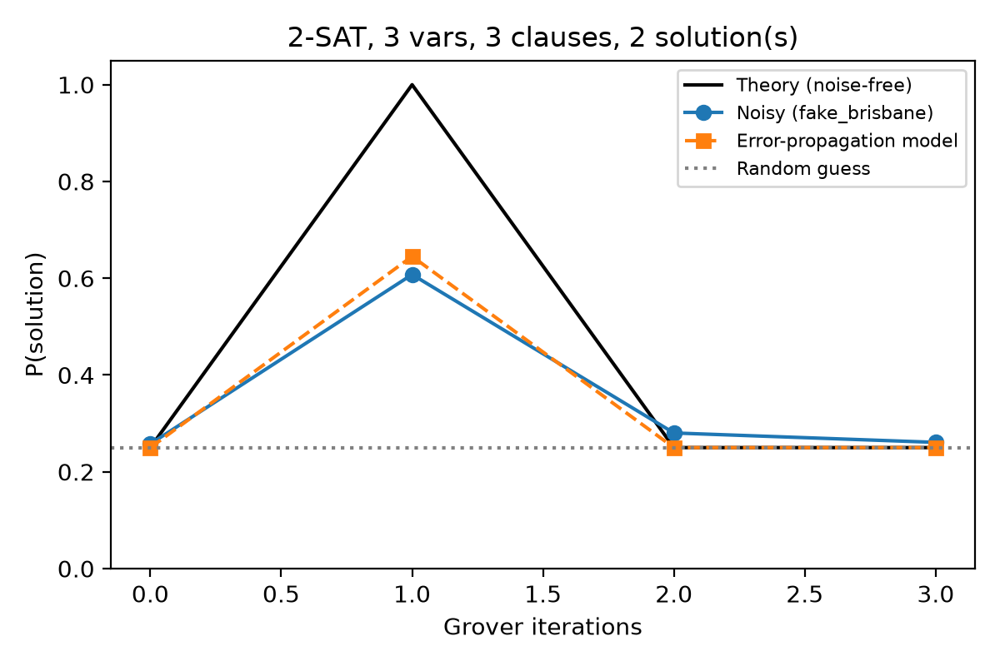
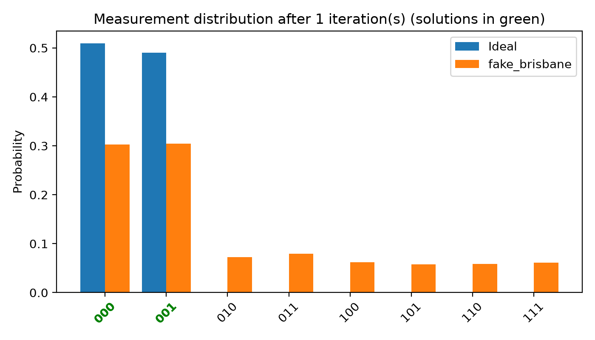

# Results

## Simulated run in this repository (`fake_brisbane_v3_c3_s3.json`)
Instance (2-SAT, 3 variables, 3 clauses): **(x1 ∨ ¬x3) ∧ (¬x3 ∨ ¬x1) ∧ (¬x2 ∨ x3)**, solutions 000, 001 (bit order x3 x2 x1).
Backend: **FakeBrisbane** calibration snapshot as an Aer noise model, 8192 shots, `optimization_level=3`.

| Grover iterations | ECR gates | Depth | P(success) theory | P(success) noisy | Error-propagation model | P(fault-free) |
|---|---|---|---|---|---|---|
| 0 | 0 | 4 | 0.250 | 0.258 | 0.250 | 0.980 |
| 1 | 77 | 345 | 1.000 | 0.608 | 0.645 | 0.527 |
| 2 | 159 | 712 | 0.250 | 0.280 | 0.250 | 0.278 |
| 3 | 241 | 1060 | 0.250 | 0.261 | 0.250 | 0.166 |

- One iteration is optimal (M/N = 2/8 → rotation of exactly π/2), giving P = 1 on ideal hardware.
- On the noise model the transpiled circuit has ~77 ECR gates; the fault-free probability drops to ~0.53 and the
  measured success to ~0.61, which the simple error-propagation model (fault-free runs succeed, faulty runs return a
  uniformly random string) predicts to within a few percent.
- Extra iterations add ~80 ECR gates each and push the output towards the uniform distribution.

Simulated numbers vary slightly between runs (shot noise and transpiler seeds) and will differ on real IBM Brisbane hardware.
