# Grover search and K-SAT on IBM Heron: full study

Every number is generated by `Code/study.py` and `Code/study_analysis.py`. The tables are also in `Results/study/*.tex` (LaTeX) and `*.csv`, and the figures are in `Figures/study/` (PDF + PNG). *Model* = IBM noise model (FakeKingston/FakeMarrakesh), *QPU* = real hardware.

## Stage A — Design and verification

### Step 1: circuit design

**K-SAT instances (exactly 3 satisfying assignments each)**

| Instance | Vars | Clauses | CNF | Solutions (x_n…x_1) | Qubits Oracle A | Qubits Oracle B |
|---|---|---|---|---|---|---|
| 5v | 5 | 6 | (x2 ∨ x4 ∨ ¬x5) ∧ (x1 ∨ x3) ∧ (¬x1 ∨ x3 ∨ ¬x4) ∧ (¬x2 ∨ ¬x3) ∧ (¬x1 ∨ ¬x2) ∧ (x2 ∨ ¬x3 ∨ x5) | 00001, 11100, 11101 | 5 | 11 |
| 6v | 6 | 7 | (x1 ∨ x5) ∧ (¬x1 ∨ ¬x6) ∧ (x1 ∨ x6) ∧ (¬x1 ∨ x6) ∧ (¬x1 ∨ ¬x3) ∧ (x2 ∨ ¬x4 ∨ ¬x6) ∧ (x1 ∨ ¬x3 ∨ ¬x6) | 110000, 110010, 111010 | 6 | 13 |

**Circuit table: two-qubit (CZ) gate count after transpilation (optimization level 3) for each multi-controlled-gate construction**

| Circuit (k=1) | MCT construction | Qubits | Ancillas | CZ Kingston | Depth Kingston | CZ Marrakesh | P = theory |
|---|---|---|---|---|---|---|---|
| Grover n=2 | No ancilla | 2 | 0 | 2 | 10 | 2 | yes |
| Grover n=2 | V-chain (Toffoli) | 2 | 0 | 2 | 10 | 2 | yes |
| Grover n=2 | V-chain (relative-phase) | 2 | 0 | 2 | 10 | 2 | yes |
| Grover n=3 | No ancilla | 3 | 0 | 17 | 67 | 17 | yes |
| Grover n=3 | V-chain (Toffoli) | 3 | 0 | 17 | 67 | 17 | yes |
| Grover n=3 | V-chain (relative-phase) | 3 | 0 | 17 | 67 | 17 | yes |
| Grover n=4 | No ancilla | 4 | 0 | 35 | 144 | 35 | yes |
| Grover n=4 | V-chain (Toffoli) | 5 | 1 | 54 | 170 | 54 | yes |
| Grover n=4 | V-chain (relative-phase) | 5 | 1 | 28 | 114 | 28 | yes |
| Grover n=5 | No ancilla | 5 | 0 | 127 | 358 | 127 | yes |
| Grover n=5 | V-chain (Toffoli) | 7 | 2 | 93 | 301 | 93 | yes |
| Grover n=5 | V-chain (relative-phase) | 7 | 2 | 52 | 184 | 52 | yes |
| Grover n=6 | No ancilla | 6 | 0 | 280 | 924 | 280 | yes |
| Grover n=6 | V-chain (Toffoli) | 9 | 3 | 134 | 408 | 134 | yes |
| Grover n=6 | V-chain (relative-phase) | 9 | 3 | 80 | 251 | 80 | yes |
| Grover n=7 | No ancilla | 7 | 0 | 479 | 1284 | 479 | yes |
| Grover n=7 | V-chain (Toffoli) | 11 | 4 | 167 | 508 | 167 | yes |
| Grover n=7 | V-chain (relative-phase) | 11 | 4 | 104 | 335 | 104 | yes |
| Grover n=8 | No ancilla | 8 | 0 | 725 | 1923 | 725 | yes |
| Grover n=8 | V-chain (Toffoli) | 13 | 5 | 204 | 620 | 204 | yes |
| Grover n=8 | V-chain (relative-phase) | 13 | 5 | 128 | 388 | 128 | yes |
| Grover n=9 | No ancilla | 9 | 0 | 947 | 2751 | 947 | yes |
| Grover n=9 | V-chain (Toffoli) | 15 | 6 | 239 | 727 | 239 | yes |
| Grover n=9 | V-chain (relative-phase) | 15 | 6 | 152 | 456 | 152 | yes |
| Grover n=10 | No ancilla | 10 | 0 | 1534 | 3756 | 1534 | yes |
| Grover n=10 | V-chain (Toffoli) | 17 | 7 | 276 | 836 | 276 | yes |
| Grover n=10 | V-chain (relative-phase) | 17 | 7 | 176 | 526 | 176 | yes |
| 5v Oracle A | No ancilla | 5 | 0 | 257 | 715 | 257 | yes |
| 5v Oracle A | V-chain (Toffoli) | 7 | 2 | 191 | 593 | 191 | yes |
| 5v Oracle A | V-chain (relative-phase) | 7 | 2 | 98 | 319 | 98 | yes |
| 5v Oracle B | No ancilla | 11 | 0 | 414 | 1039 | 414 | yes |
| 5v Oracle B | V-chain (Toffoli) | 14 | 3 | 500 | 1091 | 500 | yes |
| 5v Oracle B | V-chain (relative-phase) | 14 | 3 | 414 | 911 | 414 | yes |
| 6v Oracle A | No ancilla | 6 | 0 | 541 | 1808 | 541 | yes |
| 6v Oracle A | V-chain (Toffoli) | 9 | 3 | 278 | 813 | 278 | yes |
| 6v Oracle A | V-chain (relative-phase) | 9 | 3 | 136 | 410 | 136 | yes |
| 6v Oracle B | No ancilla | 13 | 0 | 508 | 1153 | 508 | yes |
| 6v Oracle B | V-chain (Toffoli) | 17 | 4 | 512 | 1163 | 512 | yes |
| 6v Oracle B | V-chain (relative-phase) | 17 | 4 | 429 | 913 | 429 | yes |

### Step 2: simulator baseline (Aer QASM)

**Table I: ideal QASM simulator against theory P = sin²((2k+1)θ), every marked state, 5 repetitions × 1000 shots**

| n | k | P theory | P sim (mean ± sd) | max |dev| | within 3σ | runs | time/circuit (ms) |
|---|---|---|---|---|---|---|---|
| 2 | 1 | 1.0000 | 1.0000 ± 0.0000 | 0.0000 | 100.0% | 20 | 25.03 |
| 3 | 1 | 0.7813 | 0.7849 ± 0.0128 | 0.0115 | 100.0% | 40 | 34.69 |
| 3 | 2 | 0.9453 | 0.9455 ± 0.0073 | 0.0061 | 100.0% | 40 | 21.48 |
| 4 | 1 | 0.4727 | 0.4709 ± 0.0133 | 0.0143 | 100.0% | 80 | 21.59 |
| 4 | 3 | 0.9613 | 0.9609 ± 0.0064 | 0.0045 | 100.0% | 80 | 20.65 |
| 5 | 1 | 0.2583 | 0.2601 ± 0.0134 | 0.0123 | 100.0% | 160 | 19.45 |
| 5 | 4 | 0.9992 | 0.9992 ± 0.0009 | 0.0010 | 100.0% | 160 | 22.35 |
| 6 | 1 | 0.1348 | 0.1356 ± 0.0109 | 0.0108 | 100.0% | 320 | 19.24 |
| 6 | 6 | 0.9966 | 0.9966 ± 0.0017 | 0.0016 | 100.0% | 320 | 21.34 |
| 7 | 1 | 0.0689 | 0.0683 ± 0.0081 | 0.0105 | 99.5% | 640 | 18.19 |
| 7 | 8 | 0.9956 | 0.9956 ± 0.0021 | 0.0030 | 100.0% | 640 | 21.70 |
| 8 | 1 | 0.0348 | 0.0352 ± 0.0058 | 0.0094 | 99.6% | 1280 | 20.17 |
| 8 | 12 | 0.9999 | 0.9999 ± 0.0003 | 0.0007 | 100.0% | 1280 | 26.76 |
| 9 | 1 | 0.0175 | 0.0176 ± 0.0040 | 0.0057 | 99.9% | 2560 | 19.38 |
| 9 | 17 | 0.9994 | 0.9994 ± 0.0007 | 0.0012 | 100.0% | 2560 | 31.13 |
| 10 | 1 | 0.0088 | 0.0087 ± 0.0029 | 0.0044 | 99.9% | 5120 | 18.05 |
| 10 | 25 | 0.9995 | 0.9995 ± 0.0007 | 0.0017 | 100.0% | 5120 | 37.67 |

## Stage B — Hardware runs

> **Hardware not yet run.** Every Stage B number below comes from the Step 3 noise-model predictions (FakeKingston, FakeMarrakesh), so these are *predicted* values. After `python study.py submit` and `collect`, rerunning `python study.py analyze` adds the QPU columns next to them.

### Step 4: device calibration

**Device calibration (medians over all qubits and over the qubits the circuits use)**

| Source | Calibration date | Qubits | CZ error (median) | Readout error (median) | T1 (µs) | T2 (µs) |
|---|---|---|---|---|---|---|
| Model Kingston | 2026-04-15 09:15:15+02:00 | all qubits | 1.83e-03 | 9.52e-03 | 283 | 144 |
| Model Kingston | 2026-04-15 09:15:15+02:00 | 22 used | 1.41e-03 | 8.18e-03 | 308 | 128 |
| Model Marrakesh | 2025-02-26 14:52:45-05:00 | all qubits | 3.29e-03 | 9.52e-03 | 197 | 118 |
| Model Marrakesh | 2025-02-26 14:52:45-05:00 | 15 used | 1.51e-03 | 5.13e-03 | 260 | 178 |

### Step 5: error mitigation on K-SAT (Oracle A, k = 1, 2 repetitions)

**Table II: K-SAT success probability per error-mitigation technique (ideal: 5v 0.646, 6v 0.371)**

| Source | Instance | Technique | P(solution) [95% CI] | Gain vs none | Hellinger | QPU cost (s) | Cost ratio |
|---|---|---|---|---|---|---|---|
| Model Kingston | 5v | None | 0.300 [0.285, 0.316] | +0.000 | 0.877 | 1.1 | 1.0× |
| Model Kingston | 5v | M3 | 0.311 | +0.011 | 0.885 | 3.2 | 2.8× |
| Model Kingston | 5v | DD | 0.300 [0.284, 0.316] | +0.000 | 0.877 | 1.1 | 1.0× |
| Model Kingston | 5v | Twirling | 0.300 [0.285, 0.316] | +0.001 | 0.878 | 1.1 | 1.0× |
| Model Kingston | 5v | TREX | 0.321 [0.295, 0.345] | +0.021 | 0.891 | 2.2 | 1.9× |
| Model Kingston | 5v | ZNE | 0.333 [0.308, 0.355] | +0.034 | 0.897 | 4.0 | 3.5× |
| Model Kingston | 5v | All | 0.328 [0.306, 0.351] | +0.028 | 0.895 | 5.0 | 4.5× |
| Model Kingston | 6v | None | 0.062 [0.053, 0.070] | +0.000 | 0.842 | 1.3 | 1.0× |
| Model Kingston | 6v | M3 | 0.062 | +0.001 | 0.843 | 3.3 | 2.6× |
| Model Kingston | 6v | DD | 0.069 [0.060, 0.077] | +0.008 | 0.853 | 1.3 | 1.0× |
| Model Kingston | 6v | Twirling | 0.074 [0.061, 0.086] | +0.012 | 0.859 | 1.3 | 1.0× |
| Model Kingston | 6v | TREX | 0.059 [0.046, 0.072] | -0.003 | 0.837 | 2.3 | 1.8× |
| Model Kingston | 6v | ZNE | 0.069 [0.060, 0.078] | +0.007 | 0.851 | 5.3 | 4.1× |
| Model Kingston | 6v | All | 0.074 [0.064, 0.084] | +0.013 | 0.858 | 6.3 | 4.9× |
| Model Marrakesh | 5v | None | 0.296 [0.280, 0.312] | +0.000 | 0.875 | 1.1 | 1.0× |
| Model Marrakesh | 5v | M3 | 0.302 | +0.005 | 0.879 | 3.2 | 2.8× |
| Model Marrakesh | 5v | DD | 0.293 [0.278, 0.309] | -0.004 | 0.872 | 1.1 | 1.0× |
| Model Marrakesh | 5v | Twirling | 0.291 [0.272, 0.310] | -0.005 | 0.871 | 1.1 | 1.0× |
| Model Marrakesh | 5v | TREX | 0.309 [0.290, 0.330] | +0.013 | 0.884 | 2.2 | 1.9× |
| Model Marrakesh | 5v | ZNE | 0.322 [0.300, 0.346] | +0.026 | 0.890 | 4.1 | 3.6× |
| Model Marrakesh | 5v | All | 0.326 [0.305, 0.345] | +0.029 | 0.894 | 5.1 | 4.5× |
| Model Marrakesh | 6v | None | 0.070 [0.058, 0.082] | +0.000 | 0.853 | 1.3 | 1.0× |
| Model Marrakesh | 6v | M3 | 0.071 | +0.001 | 0.854 | 3.4 | 2.6× |
| Model Marrakesh | 6v | DD | 0.079 [0.065, 0.094] | +0.010 | 0.866 | 1.3 | 1.0× |
| Model Marrakesh | 6v | Twirling | 0.080 [0.071, 0.089] | +0.010 | 0.866 | 1.3 | 1.0× |
| Model Marrakesh | 6v | TREX | 0.068 [0.060, 0.078] | -0.002 | 0.850 | 2.3 | 1.8× |
| Model Marrakesh | 6v | ZNE | 0.065 [0.057, 0.074] | -0.004 | 0.847 | 5.4 | 4.2× |
| Model Marrakesh | 6v | All | 0.080 [0.065, 0.095] | +0.010 | 0.864 | 6.4 | 5.0× |

### Step 6: K-SAT search on hardware (Oracle A, full distributions)

**K-SAT search: success probability and most frequent bitstrings**

| Source | Instance | k | P ideal | P(solution) | Hellinger | Top-3 outcomes | Solutions in top 3 |
|---|---|---|---|---|---|---|---|
| Model Kingston | 5v | 1 | 0.646 | 0.298 | 0.876 | 11100, 11101, 00001 | 3 |
| Model Kingston | 5v | 2 | 1.000 | 0.252 | 0.265 | 11100, 11101, 00001 | 3 |
| Model Kingston | 6v | 1 | 0.371 | 0.068 | 0.850 | 111010, 110000, 101101 | 2 |
| Model Kingston | 6v | 3 | 0.998 | 0.039 | 0.057 | 000111, 000100, 100101 | 0 |
| Model Marrakesh | 5v | 1 | 0.646 | 0.299 | 0.876 | 00001, 11101, 11100 | 3 |
| Model Marrakesh | 5v | 2 | 1.000 | 0.233 | 0.245 | 00001, 11101, 11100 | 3 |
| Model Marrakesh | 6v | 1 | 0.371 | 0.065 | 0.847 | 110000, 110010, 101001 | 2 |
| Model Marrakesh | 6v | 3 | 0.998 | 0.039 | 0.057 | 000101, 000100, 000111 | 0 |

### Step 7: iteration sweep (n = 3, 4)

**Iteration sweep: P(marked) against the number of Grover iterations**

| Source | n | k=0 | k=1 | k=2 | k=3 | best k (measured) | k* (theory) |
|---|---|---|---|---|---|---|---|
| Model Kingston | 3 | 0.117 | 0.743 | 0.861 | 0.298 | 2 | 2 |
| Model Kingston | 4 | 0.063 | 0.406 | 0.695 | 0.590 | 2 | 3 |
| Model Marrakesh | 3 | 0.118 | 0.758 | 0.861 | 0.298 | 2 | 2 |
| Model Marrakesh | 4 | 0.062 | 0.387 | 0.644 | 0.604 | 2 | 3 |

### Step 8: Grover scaling (n = 2–7, 3 marked states each)

**Table III: Grover scaling with the number of qubits**

| Source | n | k | P theory | P measured (mean ± sd, 3 states) | Random | CZ gates | Hellinger |
|---|---|---|---|---|---|---|---|
| Model Kingston | 2 | 1 | 1.000 | 0.986 ± 0.003 | 0.250 | 2 | 0.986 |
| Model Kingston | 3 | 1 | 0.781 | 0.729 ± 0.011 | 0.125 | 17 | 0.996 |
| Model Kingston | 3 | 2 | 0.945 | 0.851 ± 0.006 | 0.125 | 37 | 0.972 |
| Model Kingston | 4 | 1 | 0.473 | 0.423 ± 0.007 | 0.062 | 35 | 0.995 |
| Model Kingston | 4 | 3 | 0.961 | 0.578 ± 0.010 | 0.062 | 113 | 0.757 |
| Model Kingston | 5 | 1 | 0.258 | 0.157 ± 0.012 | 0.031 | 127 | 0.978 |
| Model Kingston | 6 | 1 | 0.135 | 0.043 ± 0.004 | 0.016 | 280 | 0.963 |
| Model Kingston | 7 | 1 | 0.069 | 0.018 ± 0.004 | 0.008 | 479 | 0.966 |
| Model Marrakesh | 2 | 1 | 1.000 | 0.989 ± 0.001 | 0.250 | 2 | 0.989 |
| Model Marrakesh | 3 | 1 | 0.781 | 0.739 ± 0.012 | 0.125 | 17 | 0.997 |
| Model Marrakesh | 3 | 2 | 0.945 | 0.856 ± 0.009 | 0.125 | 37 | 0.976 |
| Model Marrakesh | 4 | 1 | 0.473 | 0.408 ± 0.005 | 0.062 | 35 | 0.993 |
| Model Marrakesh | 4 | 3 | 0.961 | 0.597 ± 0.015 | 0.062 | 113 | 0.776 |
| Model Marrakesh | 5 | 1 | 0.258 | 0.165 ± 0.007 | 0.031 | 127 | 0.981 |
| Model Marrakesh | 6 | 1 | 0.135 | 0.044 ± 0.002 | 0.016 | 280 | 0.965 |
| Model Marrakesh | 7 | 1 | 0.069 | 0.014 ± 0.003 | 0.008 | 479 | 0.963 |

### Optional: best Step-1 construction on hardware

**Compilation choice versus error mitigation (Oracle A, k = 1, no mitigation)**

| Source | Instance | CZ (no ancilla) | P (no ancilla) | CZ (relative-phase V-chain) | P (relative-phase) | Gain |
|---|---|---|---|---|---|---|
| Model Kingston | 5v | 257 | 0.300 | 98 | 0.459 | +0.159 |
| Model Kingston | 6v | 541 | 0.062 | 136 | 0.212 | +0.151 |
| Model Marrakesh | 5v | 257 | 0.296 | 98 | 0.420 | +0.124 |
| Model Marrakesh | 6v | 541 | 0.070 | 136 | 0.213 | +0.143 |

## Stage C — Analysis

### Step 9: noise model against hardware

> No hardware data yet: this compares the two noise models with each other, which shows how much the predictions depend on the device. With hardware data, each model is compared with its own QPU.

**Accuracy of the noise-model prediction of P(success)**

| Comparison | Circuits | MAE | RMSE | Bias | Pearson r |
|---|---|---|---|---|---|
| Model Kingston → Model Marrakesh | 68 | 0.010 | 0.013 | -0.001 | 0.999 |

### Step 10: noise-scaling model

**Noise-scaling fit P = P_ideal F^g + (1 − F^g)/2^n (g = CZ count)**

| Source | Effective CZ fidelity F [95% CI] | 1 − F | CZ error (calibration) | Ratio | CZ gates to random (F^g=1%) | n at random (no ancilla) | n at random (rel.-phase) |
|---|---|---|---|---|---|---|---|
| Model Kingston | 0.99548 [0.99520, 0.99586] | 4.52e-03 | 1.41e-03 | 3.2× | 1016 | 10 | 20 |
| Model Marrakesh | 0.99559 [0.99535, 0.99592] | 4.41e-03 | 1.51e-03 | 2.9× | 1042 | 10 | 21 |

### Step 11: K-SAT time-to-solution

Every measured bitstring is checked against the CNF clauses. The expected number of shots to the first solution is 1/P, compared with 2ⁿ/3 for random guessing (3 solutions).

**K-SAT time-to-solution**

| Source | Instance | Technique | P(clauses satisfied) | Expected shots 1/P | Random 2ⁿ/3 | Speed-up |
|---|---|---|---|---|---|---|
| Model Kingston | 5v | None | 0.300 | 3.34 | 10.67 | 3.20× |
| Model Kingston | 5v | M3 | 0.311 | 3.22 | 10.67 | 3.31× |
| Model Kingston | 5v | DD | 0.300 | 3.33 | 10.67 | 3.20× |
| Model Kingston | 5v | Twirling | 0.300 | 3.33 | 10.67 | 3.20× |
| Model Kingston | 5v | TREX | 0.321 | 3.12 | 10.67 | 3.42× |
| Model Kingston | 5v | ZNE | 0.333 | 3.00 | 10.67 | 3.56× |
| Model Kingston | 5v | All | 0.328 | 3.05 | 10.67 | 3.50× |
| Model Kingston | 5v | none (k=1) | 0.298 | 3.35 | 10.67 | 3.18× |
| Model Kingston | 5v | none (k=2) | 0.252 | 3.97 | 10.67 | 2.69× |
| Model Kingston | 5v | none (rel.-phase, k=1) | 0.461 | 2.17 | 10.67 | 4.92× |
| Model Kingston | 6v | None | 0.062 | 16.25 | 21.33 | 1.31× |
| Model Kingston | 6v | M3 | 0.062 | 16.03 | 21.33 | 1.33× |
| Model Kingston | 6v | DD | 0.069 | 14.47 | 21.33 | 1.47× |
| Model Kingston | 6v | Twirling | 0.074 | 13.59 | 21.33 | 1.57× |
| Model Kingston | 6v | TREX | 0.059 | 16.95 | 21.33 | 1.26× |
| Model Kingston | 6v | ZNE | 0.069 | 14.53 | 21.33 | 1.47× |
| Model Kingston | 6v | All | 0.074 | 13.45 | 21.33 | 1.59× |
| Model Kingston | 6v | none (k=1) | 0.068 | 14.79 | 21.33 | 1.44× |
| Model Kingston | 6v | none (k=3) | 0.039 | 25.44 | 21.33 | 0.84× |
| Model Kingston | 6v | none (rel.-phase, k=1) | 0.213 | 4.70 | 21.33 | 4.54× |
| Model Marrakesh | 5v | None | 0.296 | 3.37 | 10.67 | 3.16× |
| Model Marrakesh | 5v | M3 | 0.302 | 3.31 | 10.67 | 3.22× |
| Model Marrakesh | 5v | DD | 0.293 | 3.41 | 10.67 | 3.12× |
| Model Marrakesh | 5v | Twirling | 0.291 | 3.43 | 10.67 | 3.11× |
| Model Marrakesh | 5v | TREX | 0.309 | 3.24 | 10.67 | 3.30× |
| Model Marrakesh | 5v | ZNE | 0.322 | 3.10 | 10.67 | 3.44× |
| Model Marrakesh | 5v | All | 0.326 | 3.07 | 10.67 | 3.47× |
| Model Marrakesh | 5v | none (k=1) | 0.299 | 3.35 | 10.67 | 3.18× |
| Model Marrakesh | 5v | none (k=2) | 0.233 | 4.30 | 10.67 | 2.48× |
| Model Marrakesh | 5v | none (rel.-phase, k=1) | 0.419 | 2.39 | 10.67 | 4.47× |
| Model Marrakesh | 6v | None | 0.070 | 14.32 | 21.33 | 1.49× |
| Model Marrakesh | 6v | M3 | 0.071 | 14.14 | 21.33 | 1.51× |
| Model Marrakesh | 6v | DD | 0.079 | 12.60 | 21.33 | 1.69× |
| Model Marrakesh | 6v | Twirling | 0.080 | 12.53 | 21.33 | 1.70× |
| Model Marrakesh | 6v | TREX | 0.068 | 14.66 | 21.33 | 1.46× |
| Model Marrakesh | 6v | ZNE | 0.065 | 15.28 | 21.33 | 1.40× |
| Model Marrakesh | 6v | All | 0.080 | 12.57 | 21.33 | 1.70× |
| Model Marrakesh | 6v | none (k=1) | 0.065 | 15.40 | 21.33 | 1.39× |
| Model Marrakesh | 6v | none (k=3) | 0.039 | 25.76 | 21.33 | 0.83× |
| Model Marrakesh | 6v | none (rel.-phase, k=1) | 0.214 | 4.68 | 21.33 | 4.56× |

### Step 12: statistics and cost–benefit

95% confidence intervals are percentile bootstraps (1000 resamples of the shots for unmitigated runs, 200 for mitigated runs, which recompute the whole mitigation from resampled counts). Hellinger fidelity compares each output distribution with the exact one.

**Cost–benefit of each mitigation technique (average of both instances)**

| Source | Technique | ΔP(solution) | ΔHellinger | QPU cost per run (s) | Cost ratio | ΔP per extra second |
|---|---|---|---|---|---|---|
| Model Kingston | None | +0.000 | +0.000 | 1.2 | 1.0× | – |
| Model Kingston | M3 | +0.006 | +0.004 | 3.3 | 2.7× | +0.0028 |
| Model Kingston | DD | +0.004 | +0.005 | 1.2 | 1.0× | – |
| Model Kingston | Twirling | +0.006 | +0.009 | 1.2 | 1.0× | +4.5714 |
| Model Kingston | TREX | +0.009 | +0.004 | 2.2 | 1.9× | +0.0090 |
| Model Kingston | ZNE | +0.020 | +0.014 | 4.6 | 3.8× | +0.0060 |
| Model Kingston | All | +0.021 | +0.017 | 5.7 | 4.7× | +0.0046 |
| Model Marrakesh | None | +0.000 | +0.000 | 1.2 | 1.0× | – |
| Model Marrakesh | M3 | +0.003 | +0.002 | 3.3 | 2.7× | +0.0015 |
| Model Marrakesh | DD | +0.003 | +0.005 | 1.2 | 1.0× | – |
| Model Marrakesh | Twirling | +0.002 | +0.004 | 1.2 | 1.0× | +1.7219 |
| Model Marrakesh | TREX | +0.005 | +0.003 | 2.3 | 1.9× | +0.0053 |
| Model Marrakesh | ZNE | +0.011 | +0.004 | 4.7 | 3.9× | +0.0030 |
| Model Marrakesh | All | +0.019 | +0.015 | 5.8 | 4.7× | +0.0043 |

### Practical recommendations

- **Model Kingston**: largest gain from **All** (ΔP = +0.021 at 4.7× QPU cost); best value per QPU second **Twirling** (+0.006); best at ≤1.2× cost **Twirling** (+0.006).
- **Model Marrakesh**: largest gain from **All** (ΔP = +0.019 at 4.7× QPU cost); best value per QPU second **DD** (+0.003); best at ≤1.2× cost **DD** (+0.003).
- **Compile first (Model Kingston)**: the relative-phase V-chain construction raises P(solution) by +0.155 on average at no extra QPU cost, against +0.021 for the best mitigation technique.
- **Compile first (Model Marrakesh)**: the relative-phase V-chain construction raises P(solution) by +0.134 on average at no extra QPU cost, against +0.019 for the best mitigation technique.
- Model Kingston: effective CZ fidelity 0.9955. A circuit keeps only 1% of its ideal signal after ≈1016 CZ gates, so compilation (fewer CZ) matters more than mitigation once circuits exceed a few hundred CZ gates.
- Model Marrakesh: effective CZ fidelity 0.9956. A circuit keeps only 1% of its ideal signal after ≈1042 CZ gates, so compilation (fewer CZ) matters more than mitigation once circuits exceed a few hundred CZ gates.

## Figures

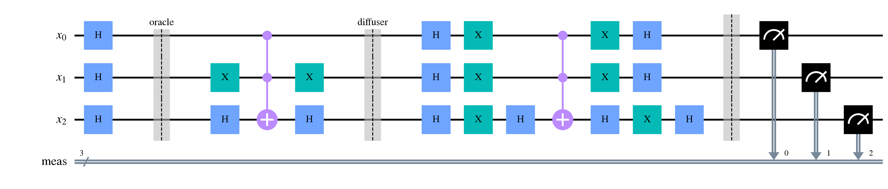
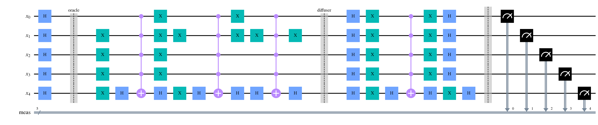
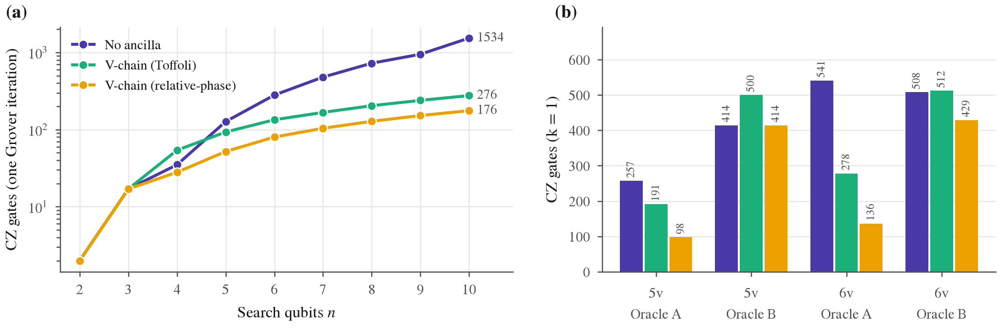
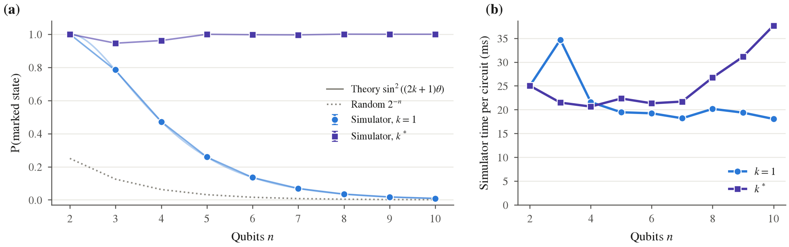
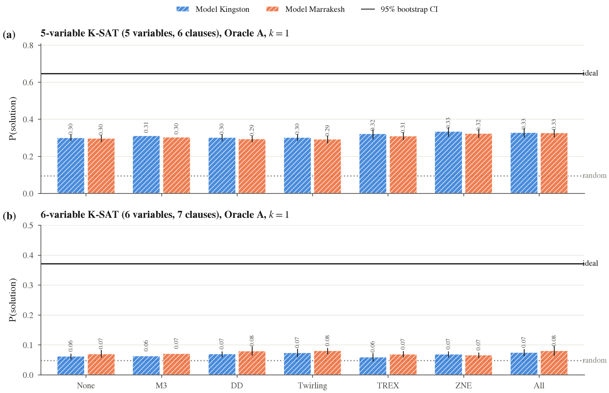
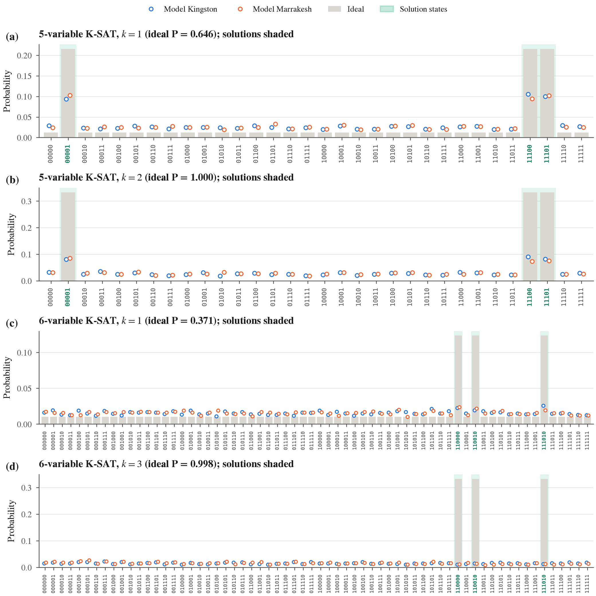
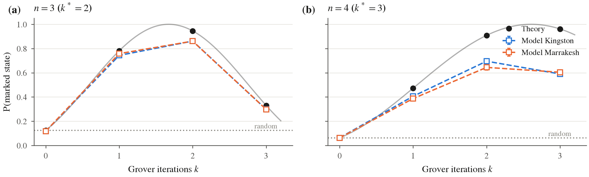
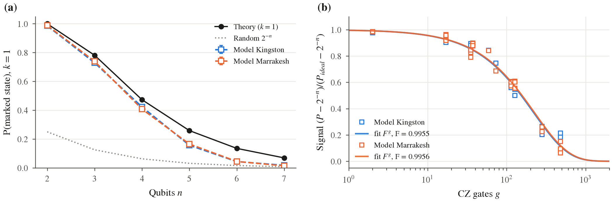
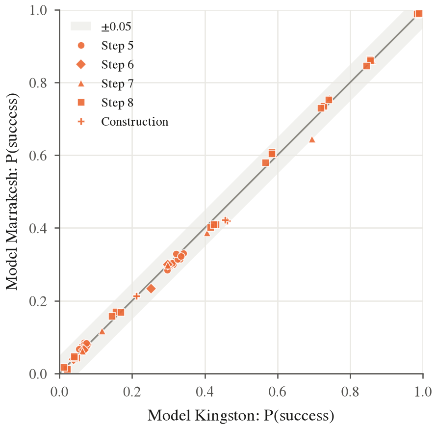
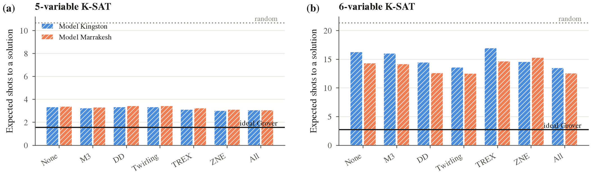
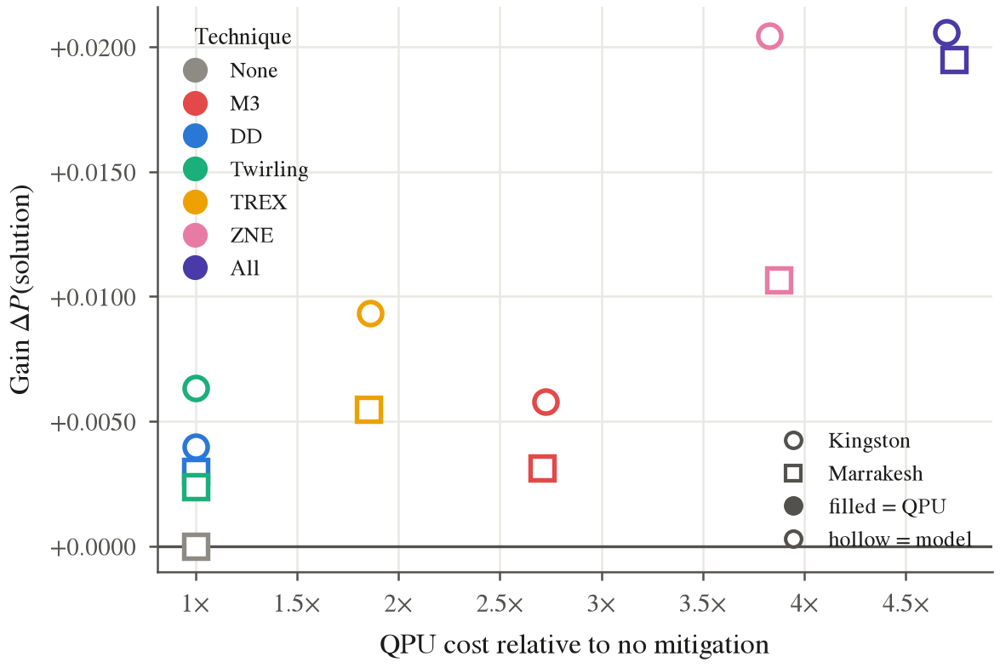
